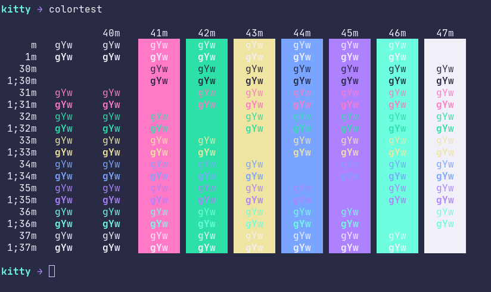
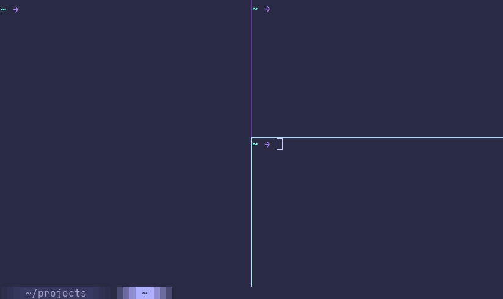

# Rebecca theme for kitty

A simple version of Rebecca theme for
[kitty](https://github.com/kovidgoyal/kitty/).





## Installation

Download or git clone this repo and include `rebecca-theme.conf`
in your `kitty.conf` file.
<kbd>Ctrl</kbd>+<kbd>Shift</kbd>+<kbd>F2</kbd> or <kbd>⌘</kbd>+<kbd>,</kbd> will open
`~/.config/kitty/kitty.conf` on your default `EDITOR`, if the file
doesn't exist kitty will create it:

```conf
...
# BEGIN_KITTY_THEME
# Rebecca Purple Theme
include path-to-rebecca-theme.conf
# END_KITTY_THEME
```

The next time you open kitty the theme will be applied.

## Colorscheme

This theme is based on Rebecca Emacs Theme:
[https://github.com/vic/rebecca-theme](https://github.com/vic/rebecca-theme)


| Color   | Hex Normal                                                           | Hex Bright                                                           |
|---------|----------------------------------------------------------------------|----------------------------------------------------------------------|
| Black   |  #292A44 |  #53495D |
| Red     |  #FF79C6 |  #FF5FAF |
| Green   |  #2DE0A7 |  #5FD7AF |
| Yellow  |  #EFE4A1 |  #FFFF87 |
| Blue    |  #7AA5FF |  #5FAFFF |
| Magenta |  #AE81FF |  #AF5FFF |
| Cyan    |  #6DFEDF |  #87FFD7 |
| White   |  #F1EFF8 |  #E4E4E4 |

You can find the full colorscheme on the repo above or download the
[GIMP Color Palette](./palette/Rebecca.gpl) in this repo.

